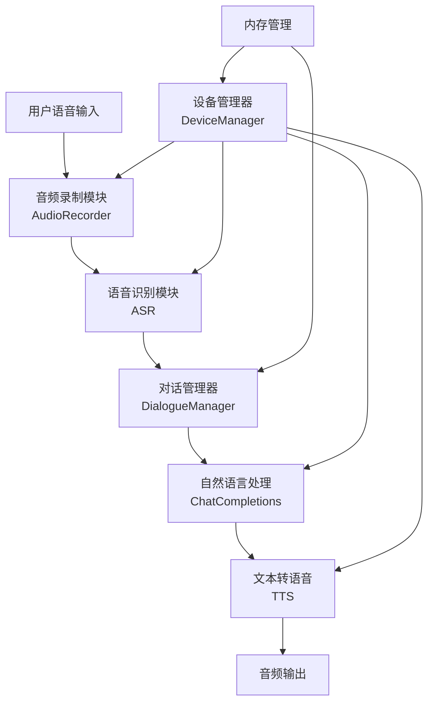

# YiYuan 智能语音助手系统

一个完整的智能语音交互解决方案，集成语音识别(ASR)、自然语言处理(NLP)和语音合成(TTS)功能。

## 项目架构



## 系统流程

1. **音频录制**
   - 通过 AudioRecorder 类处理音频输入
   - 支持超时和错误处理
   - 自动清理无效录音文件

2. **语音识别 (ASR)**
   - 将录制的音频转换为文本
   - 使用高效的语音识别算法
   - 支持实时转写

3. **对话管理**
   - 管理对话流程和状态
   - 处理用户输入和系统响应
   - 支持流式文本处理

4. **自然语言处理**
   - 使用 ChatCompletions 处理用户输入
   - 生成智能回复
   - 支持上下文理解

5. **语音合成 (TTS)**
   - 将系统响应转换为语音
   - 支持分块处理长文本
   - 优化的音频输出质量

## 目录结构

```
yiyuan/
├── app/                    # 应用主目录
│   ├── api/               # API 接口定义
│   ├── core/              # 核心功能模块
│   ├── models/            # 数据模型定义
│   ├── services/          # 业务服务层
│   └── main.py           # 应用入口
├── tests/                 # 测试用例
├── ark_file.py           # 自然语言处理模块
├── asr_file.py           # 语音识别模块
├── dev_file.py           # 设备管理模块
├── main.py               # 主程序入口
├── requirements.txt      # 项目依赖
├── threading.py          # 线程管理模块
├── threading_new.py      # 新版线程管理模块
└── tts_file.py          # 语音合成模块
```

## 主要依赖

- FastAPI: Web 框架
- uvicorn: ASGI 服务器
- SQLAlchemy: 数据库 ORM
- python-multipart: 文件上传支持
- aiohttp: 异步 HTTP 客户端
- pytest: 测试框架

## 特性

- 🎯 高性能异步处理
- 🔒 内置内存管理和优化
- 🧵 多线程支持
- 📝 完整的测试覆盖
- 🔌 模块化设计
- 🔄 实时语音交互

## 开发环境设置

1. 克隆仓库
```bash
git clone https://github.com/pleasureswx123/voice-assistant.git
cd voice-assistant
```

2. 安装依赖
```bash
pip install -r requirements.txt
```

3. 运行应用
```bash
python main.py
```

## 测试

运行测试用例：
```bash
pytest
```

## 贡献

欢迎提交 Pull Request 和 Issue！

## 许可证

[MIT License](LICENSE) 